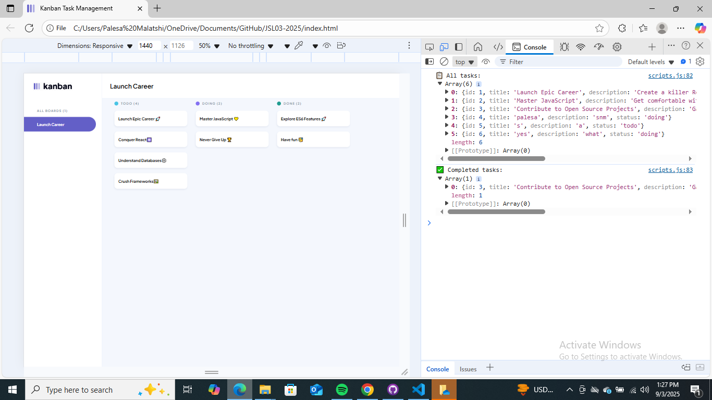

# 📝 JSL03: Console-Based Task Manager

## 📌 Project Overview
This project is a simple **console-based task management system** built with JavaScript.  
Users can add up to three new tasks, each stored as an object with a unique ID.  
The system allows filtering completed tasks and provides clear console logs for review.

---

## 🚀 Features Implemented
- Store tasks as objects in an array for structured data management.  
- Add up to **three new tasks** with title, description, and status.  
- Assign each new task a **unique incremental ID**.  
- Prompt-based user interaction for entering task details.  
- Alerts user when the **task limit is reached**:
  > "There are enough tasks on your board, please check them in the console."  
- Filter function to display only tasks marked as `"done"`.  
- Console logs all tasks and completed tasks with clear labels.  
- Descriptive function/variable names and explanatory comments for readability.  

---

## 🛠️ Technologies Used
- **JavaScript (ES6)**  
- **Browser Console (for interaction and logging)**  

---

## ⚙️ Setup & Usage
1. Clone or download this repository.  
2. Open the project in your code editor.  
3. Run the project in a browser:
   - Open `index.html` in your browser.  
   - Open the **console** (`Ctrl + Shift + J` or `Cmd + Option + J`).  
4. Follow the prompts to add tasks.  
5. Check the console for:
   - `📋 All tasks` → shows every task.  
   - `✅ Completed tasks` → shows only tasks with status `"done"`.  

---

## 🖼️ Example Screenshot
Below is an example of the console output:  
